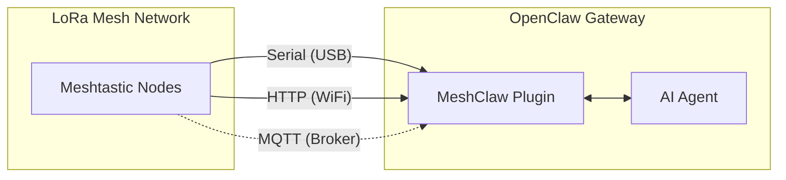

# MeshClaw: Plugin de canal OpenClaw para Meshtastic

<p align="center">
  <a href="https://www.npmjs.com/package/@seeed-studio/meshtastic">
    
  </a>
  <a href="https://www.npmjs.com/package/@seeed-studio/meshtastic">
    
  </a>
</p>

<!-- LANG_SWITCHER_START -->
<p align="center">
  <a href="README.md">English</a> | <a href="README.zh-CN.md">中文</a> | <a href="README.ja.md">日本語</a> | <a href="README.fr.md">Français</a> | <a href="README.pt.md">Português</a> | <b>Español</b>
</p>
<!-- LANG_SWITCHER_END -->

<p align="center">
  
</p>

MeshClaw es un plugin de canal para OpenClaw que conecta tu gateway AI a redes mesh LoRa de Meshtastic mediante Serial (USB), HTTP (WiFi) o MQTT.

> [!IMPORTANT]
> Este es un **plugin de canal para OpenClaw**, no una aplicación independiente. Se requiere un gateway [OpenClaw](https://github.com/openclaw/openclaw) (Node.js 22+) en ejecución para usar este plugin.

[Documentación de Meshtastic][docs] · [Reportar bug][issues] · [Solicitar funcionalidad][issues]

## Tabla de contenidos

- [Prerrequisitos](#prerrequisitos)
- [Inicio rápido](#inicio-rápido)
- [Cómo funciona](#cómo-funciona)
- [Características principales](#características-principales)
- [Modos de transporte](#modos-de-transporte)
- [Control de acceso](#control-de-acceso)
- [Configuración](#configuración)
- [Demo](#demo)
- [Hardware recomendado](#hardware-recomendado)
- [Solución de problemas](#solución-de-problemas)
- [Limitaciones](#limitaciones)
- [Desarrollo](#desarrollo)
- [Contribuciones](#contribuciones)
- [Licencia](#licencia)

## Prerrequisitos

- Gateway de OpenClaw instalado y en ejecución
- Node.js 22+
- Un método de conexión Meshtastic:
  - Dispositivo Serial mediante USB, o
  - Dispositivo Meshtastic con HTTP habilitado en la red local, o
  - Acceso a un broker MQTT (no requiere hardware local)

## Inicio rápido

```bash
# 1) Instalar el plugin desde npm
openclaw plugins install @seeed-studio/meshtastic

# 2) Ejecutar la configuración guiada
openclaw onboard

# 3) Verificar el estado del canal
openclaw channels status --probe
```

<p align="center">
  
</p>

## Cómo funciona



Los mensajes entrantes pasan por verificaciones de políticas de mensajes directos y grupales antes de llegar al AI Agent. Las respuestas salientes se convierten a texto plano y se fragmentan para la transmisión por radio.

## Características principales

- **Tres transportes**: Serial, HTTP y MQTT
- **Controles de política de mensajes directos**: `pairing`, `open` o `allowlist`
- **Controles de política de grupo**: `disabled`, `open` o `allowlist`
- **Filtrado por @mention**: responder solo en grupos cuando se menciona (opcional)
- **Soporte multi-cuenta**: ejecutar múltiples conexiones Meshtastic independientes
- **Manejo resiliente del transporte**: comportamiento de reconexión para enlaces inestables

## Modos de transporte

| Modo | Ideal para | Campos requeridos |
|---|---|---|
| `serial` | Nodo conectado por USB local | `transport`, `serialPort` |
| `http` | Nodo accesible en red local | `transport`, `httpAddress` |
| `mqtt` | Sin hardware local, broker compartido | `transport`, `mqtt.*`, `nodeName` |

Notas:
- `serial` es el transporte predeterminado.
- Valores predeterminados de `mqtt`: broker `mqtt.meshtastic.org`, topic `msh/US/2/json/#`.
- La configuración de región aplica a Serial/HTTP; MQTT deriva la región del topic.

## Control de acceso

### Política de mensajes directos (`dmPolicy`)

| Valor | Comportamiento |
|---|---|
| `pairing` (predeterminado) | Los usuarios nuevos requieren aprobación antes de chatear por mensaje directo |
| `open` | Cualquier nodo puede enviar mensajes directos |
| `allowlist` | Solo los IDs en `allowFrom` pueden enviar mensajes directos |

### Política de grupo (`groupPolicy`)

| Valor | Comportamiento |
|---|---|
| `disabled` (predeterminado) | Ignorar canales de grupo |
| `open` | Responder en todos los canales de grupo |
| `allowlist` | Responder solo en los canales configurados |

También puedes requerir mención por canal (`requireMention`) para que el bot solo responda cuando se lo etiquete explícitamente.

## Configuración

Usa `openclaw onboard` para la configuración guiada, o edita la configuración manualmente con `openclaw config edit`.

### Serial (USB)

```yaml
channels:
  meshtastic:
    transport: serial
    serialPort: /dev/ttyUSB0
    nodeName: OpenClaw
```

### HTTP (WiFi)

```yaml
channels:
  meshtastic:
    transport: http
    httpAddress: meshtastic.local
    nodeName: OpenClaw
```

### MQTT (Broker)

```yaml
channels:
  meshtastic:
    transport: mqtt
    nodeName: OpenClaw
    mqtt:
      broker: mqtt.meshtastic.org
      username: meshdev
      password: large4cats
      topic: "msh/US/2/json/#"
```

### Multi-cuenta

```yaml
channels:
  meshtastic:
    accounts:
      home:
        transport: serial
        serialPort: /dev/ttyUSB0
      remote:
        transport: mqtt
        mqtt:
          broker: mqtt.meshtastic.org
          topic: "msh/US/2/json/#"
```

<details>
<summary><b>Referencia de configuración</b></summary>

| Clave | Tipo | Predeterminado | Notas |
|---|---|---|---|
| `transport` | `serial \| http \| mqtt` | `serial` | Transporte base |
| `serialPort` | `string` | - | Requerido para `serial` |
| `httpAddress` | `string` | `meshtastic.local` | Requerido para `http` |
| `httpTls` | `boolean` | `false` | HTTP TLS |
| `mqtt.broker` | `string` | `mqtt.meshtastic.org` | Host del broker MQTT |
| `mqtt.port` | `number` | `1883` | Puerto MQTT |
| `mqtt.username` | `string` | `meshdev` | Usuario MQTT |
| `mqtt.password` | `string` | `large4cats` | Contraseña MQTT |
| `mqtt.topic` | `string` | `msh/US/2/json/#` | Topic de suscripción |
| `mqtt.publishTopic` | `string` | derivado | Sobrescritura opcional |
| `mqtt.tls` | `boolean` | `false` | MQTT TLS |
| `region` | enum | `UNSET` | Solo Serial/HTTP |
| `nodeName` | `string` | auto-detect | Requerido para MQTT |
| `dmPolicy` | `open \| pairing \| allowlist` | `pairing` | Política de acceso a mensajes directos |
| `allowFrom` | `string[]` | - | Lista de permitidos para mensajes directos, ej. `!aabbccdd` |
| `groupPolicy` | `open \| allowlist \| disabled` | `disabled` | Política de canales de grupo |
| `channels` | `Record<string, object>` | - | Sobrescrituras por canal |
| `textChunkLimit` | `number` | `200` | Rango permitido: `50-500` |

</details>

<details>
<summary><b>Sobrescrituras mediante variables de entorno</b></summary>

Estas variables sobrescriben los campos de la cuenta predeterminada:

| Variable | Clave de config |
|---|---|
| `MESHTASTIC_TRANSPORT` | `transport` |
| `MESHTASTIC_SERIAL_PORT` | `serialPort` |
| `MESHTASTIC_HTTP_ADDRESS` | `httpAddress` |
| `MESHTASTIC_MQTT_BROKER` | `mqtt.broker` |
| `MESHTASTIC_MQTT_TOPIC` | `mqtt.topic` |

</details>

## Demo

<div align="center">

https://github.com/user-attachments/assets/837062d9-a5bb-4e0a-b7cf-298e4bdf2f7c

</div>

Alternativa: [media/demo.mp4](media/demo.mp4)

## Hardware recomendado

<p align="center">
  
</p>

| Dispositivo | Ideal para | Enlace |
|---|---|---|
| XIAO ESP32S3 + Wio-SX1262 kit | Desarrollo de nivel inicial | [Comprar][hw-xiao] |
| Wio Tracker L1 Pro | Gateway portátil de campo | [Comprar][hw-wio] |
| SenseCAP Card Tracker T1000-E | Tracker compacto | [Comprar][hw-sensecap] |

Cualquier dispositivo compatible con Meshtastic funciona. El modo MQTT puede ejecutarse sin hardware local.

## Solución de problemas

| Síntoma | Verificar |
|---|---|
| No se puede conectar por Serial | ¿Es correcto `serialPort`? ¿El host tiene permisos sobre el dispositivo? |
| No se puede conectar por HTTP | ¿Es accesible `httpAddress`? ¿Está `httpTls` configurado correctamente? |
| MQTT no recibe mensajes | ¿Es correcta la región del topic? ¿Son válidas las credenciales del broker? |
| No hay respuestas a mensajes directos | Verifica `dmPolicy` y `allowFrom` |
| No hay respuestas en grupos | Verifica `groupPolicy`, la lista de permitidos y el requisito de mención |

Al crear una issue, incluye el modo de transporte, la configuración (sin secretos) y el output de `openclaw channels status --probe`.

## Limitaciones

- Los mensajes LoRa tienen ancho de banda limitado; las respuestas se fragmentan (`textChunkLimit`, valor predeterminado `200`).
- El formato markdown avanzado se elimina antes de enviar a los dispositivos de radio.
- La calidad de la mesh, el alcance y la latencia dependen del entorno de radio y las condiciones de la red.

## Desarrollo

```bash
git clone https://github.com/Seeed-Solution/openclaw-meshtastic.git
cd openclaw-meshtastic
npm install
openclaw plugins install -l ./openclaw-meshtastic
openclaw channels status --probe
```

No se requiere paso de build. OpenClaw carga el código fuente TypeScript directamente desde `index.ts`.

## Contribuciones

- Abre issues y solicitudes de funcionalidades mediante [GitHub Issues][issues]
- Los Pull Requests son bienvenidos
- Mantén los cambios alineados con las convenciones existentes de TypeScript

## Licencia

MIT

<!-- Reference-style links -->
[docs]: https://meshtastic.org/docs/
[issues]: https://github.com/Seeed-Solution/openclaw-meshtastic/issues
[hw-xiao]: https://www.seeedstudio.com/Wio-SX1262-with-XIAO-ESP32S3-p-5982.html
[hw-wio]: https://www.seeedstudio.com/Wio-Tracker-L1-Pro-p-6454.html
[hw-sensecap]: https://www.seeedstudio.com/SenseCAP-Card-Tracker-T1000-E-for-Meshtastic-p-5913.html