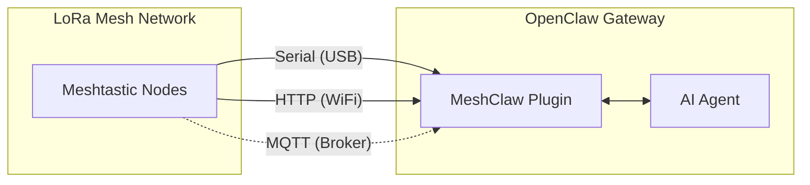

# MeshClaw : plugin de canal Meshtastic pour OpenClaw

<p align="center">
  <a href="https://www.npmjs.com/package/@seeed-studio/meshtastic">
    
  </a>
  <a href="https://www.npmjs.com/package/@seeed-studio/meshtastic">
    
  </a>
</p>

<!-- LANG_SWITCHER_START -->
<p align="center">
  <a href="README.md">English</a> | <a href="README.zh-CN.md">中文</a> | <a href="README.ja.md">日本語</a> | <b>Français</b> | <a href="README.pt.md">Português</a> | <a href="README.es.md">Español</a>
</p>
<!-- LANG_SWITCHER_END -->

<p align="center">
  
</p>

**MeshClaw** est un plugin de canal pour OpenClaw qui permet à votre passerelle AI d'envoyer et recevoir des messages via Meshtastic — pas d'internet, pas d'antennes relais, juste des ondes radio. Dialoguez avec votre assistant AI depuis la montagne, l'océan, ou partout où le réseau ne passe pas.

> [!IMPORTANT]
> Ce dépôt est un plugin de canal OpenClaw, pas une application autonome.
> Une passerelle OpenClaw (Node.js 22+) est requise pour utiliser ce plugin.

[Documentation Meshtastic][docs] · [Signaler un bug][issues] · [Demander une fonctionnalité][issues]

⭐ Starrez-nous sur GitHub — ça nous motive beaucoup !

## Table des matières

- [Fonctionnalités](#fonctionnalités)
- [Capacités et feuille de route](#capacités-et-feuille-de-route)
- [Prérequis](#prérequis)
- [Démarrage rapide](#démarrage-rapide)
- [Fonctionnement](#fonctionnement)
- [Modes de transport](#modes-de-transport)
- [Contrôle d'accès](#contrôle-daccès)
- [Configuration](#configuration)
- [Démo](#démo)
- [Matériel recommandé](#matériel-recommandé)
- [Dépannage](#dépannage)
- [Limites](#limites)
- [Développement](#développement)
- [Contribution](#contribution)

## Fonctionnalités

- **Intégration AI Agent** — Connecte les AI Agents OpenClaw aux réseaux mesh LoRa Meshtastic. Permet une communication intelligente sans dépendance au cloud.
- **Trois modes de transport** — Prise en charge du Serial (USB), HTTP (WiFi) et MQTT
- **Messages privés et canaux de groupe avec contrôle d'accès** — Prend en charge les deux modes de conversation avec listes autorisées pour les messages privés, règles de réponse par canal et filtrage par @mention
- **Prise en charge multi-comptes** — Exécutez plusieurs connexions indépendantes simultanément
- **Communication mesh résiliente** — Reconnexion automatique avec tentatives configurables. Gère les déconnexions avec élégance.

## Capacités et feuille de route

Ce plugin considère Meshtastic comme un canal de première classe — à l'instar de Telegram ou Discord — permettant des conversations AI et l'invocation de skills entièrement via radio LoRa, sans dépendance à internet.

| Interroger des informations hors ligne | Pont inter-canaux : envoyez hors réseau, recevez partout | Prochainement |
|---|---|---|
|  |  | Nous prévoyons d'intégrer les données de nœud en temps réel (localisation GPS, capteurs environnementaux, statut des appareils) dans le contexte d'OpenClaw, permettant à l'AI de surveiller la santé du réseau mesh et de diffuser des alertes proactives sans attendre les requêtes utilisateur. |

## Prérequis

- Passerelle OpenClaw installée et en cours d'exécution
- Node.js 22+
- Une méthode de connexion Meshtastic :
  - Appareil Serial via USB, ou
  - Appareil Meshtastic HTTP sur le réseau local, ou
  - Accès à un broker MQTT (aucun matériel local requis)

## Démarrage rapide

```bash
# 1) Install plugin from npm
openclaw plugins install @seeed-studio/meshtastic

# 2) Run guided setup
openclaw onboard

# 3) Verify channel status
openclaw channels status --probe
```

<p align="center">
  
</p>

## Fonctionnement



Les messages entrants passent par les vérifications de politique de messages privés/de groupe avant d'atteindre l'AI Agent.
Les réponses sortantes sont converties en texte brut et découpées pour l'envoi radio.

## Modes de transport

| Mode | Idéal pour | Champs requis |
|---|---|---|
| `serial` | Nœud local connecté en USB | `transport`, `serialPort` |
| `http` | Nœud joignable sur le réseau local | `transport`, `httpAddress` |
| `mqtt` | Aucun matériel local, broker partagé | `transport`, `mqtt.*`, `nodeName` |

Notes :
- `serial` est le transport par défaut.
- Valeurs par défaut mqtt : broker `mqtt.meshtastic.org`, topic `msh/US/2/json/#`.
- Le paramètre de région s'applique au Serial/HTTP ; MQTT déduit la région du topic.

## Contrôle d'accès

### Politique de messages privés (`dmPolicy`)

| Valeur | Comportement |
|---|---|
| `pairing` (par défaut) | Les nouveaux utilisateurs doivent être approuvés avant les conversations privées |
| `open` | Tout nœud peut envoyer des messages privés |
| `allowlist` | Seuls les IDs présents dans `allowFrom` peuvent envoyer des messages privés |

### Politique de groupe (`groupPolicy`)

| Valeur | Comportement |
|---|---|
| `disabled` (par défaut) | Ignorer les canaux de groupe |
| `open` | Répondre dans tous les canaux de groupe |
| `allowlist` | Répondre uniquement dans les canaux configurés |

Vous pouvez aussi exiger une mention par canal (`requireMention`) pour que le bot ne réponde que lorsqu'il est explicitement tagué.

## Configuration

Utilisez `openclaw onboard` pour une configuration guidée, ou modifiez la configuration manuellement avec `openclaw config edit`.

### Serial (USB)

```yaml
channels:
  meshtastic:
    transport: serial
    serialPort: /dev/ttyUSB0
    nodeName: OpenClaw
```

### HTTP (WiFi)

```yaml
channels:
  meshtastic:
    transport: http
    httpAddress: meshtastic.local
    nodeName: OpenClaw
```

### MQTT (Broker)

```yaml
channels:
  meshtastic:
    transport: mqtt
    nodeName: OpenClaw
    mqtt:
      broker: mqtt.meshtastic.org
      username: meshdev
      password: large4cats
      topic: "msh/US/2/json/#"
```

### Multi-compte

```yaml
channels:
  meshtastic:
    accounts:
      home:
        transport: serial
        serialPort: /dev/ttyUSB0
      remote:
        transport: mqtt
        mqtt:
          broker: mqtt.meshtastic.org
          topic: "msh/US/2/json/#"
```

<details>
<summary><b>Référence de configuration</b></summary>

| Clé | Type | Défaut | Notes |
|---|---|---|---|
| `transport` | `serial \| http \| mqtt` | `serial` | Transport de base |
| `serialPort` | `string` | - | Requis pour `serial` |
| `httpAddress` | `string` | `meshtastic.local` | Requis pour `http` |
| `httpTls` | `boolean` | `false` | TLS HTTP |
| `mqtt.broker` | `string` | `mqtt.meshtastic.org` | Hôte du broker MQTT |
| `mqtt.port` | `number` | `1883` | Port MQTT |
| `mqtt.username` | `string` | `meshdev` | Nom d'utilisateur MQTT |
| `mqtt.password` | `string` | `large4cats` | Mot de passe MQTT |
| `mqtt.topic` | `string` | `msh/US/2/json/#` | Topic d'abonnement |
| `mqtt.publishTopic` | `string` | dérivé | Surcharge optionnelle |
| `mqtt.tls` | `boolean` | `false` | TLS MQTT |
| `region` | enum | `UNSET` | Uniquement Serial/HTTP |
| `nodeName` | `string` | auto-détecté | Requis pour MQTT |
| `dmPolicy` | `open \| pairing \| allowlist` | `pairing` | Politique d'accès aux messages privés |
| `allowFrom` | `string[]` | - | Liste autorisée pour messages privés, ex. `!aabbccdd` |
| `groupPolicy` | `open \| allowlist \| disabled` | `disabled` | Politique des canaux de groupe |
| `channels` | `Record<string, object>` | - | Surcharges par canal |
| `textChunkLimit` | `number` | `200` | Plage autorisée : `50-500` |

</details>

<details>
<summary><b>Surcharges par variables d'environnement</b></summary>

Ces variables surchargent les champs du compte par défaut :

| Variable | Clé de config |
|---|---|
| `MESHTASTIC_TRANSPORT` | `transport` |
| `MESHTASTIC_SERIAL_PORT` | `serialPort` |
| `MESHTASTIC_HTTP_ADDRESS` | `httpAddress` |
| `MESHTASTIC_MQTT_BROKER` | `mqtt.broker` |
| `MESHTASTIC_MQTT_TOPIC` | `mqtt.topic` |

</details>

## Démo

<div align="center">

https://github.com/user-attachments/assets/837062d9-a5bb-4e0a-b7cf-298e4bdf2f7c

</div>

Fallback : [media/demo.mp4](media/demo.mp4)

## Matériel recommandé

<p align="center">
  
</p>

| Appareil | Idéal pour | Lien |
|---|---|---|
| Kit XIAO ESP32S3 + Wio-SX1262 | Développement débutant | [Acheter][hw-xiao] |
| Wio Tracker L1 Pro | Passerelle de terrain portable | [Acheter][hw-wio] |
| SenseCAP Card Tracker T1000-E | Tracker compact | [Acheter][hw-sensecap] |

Tout appareil compatible Meshtastic fonctionne. Le mode MQTT peut fonctionner sans matériel local.

## Dépannage

| Symptôme | Vérifier |
|---|---|
| Serial ne se connecte pas | Le `serialPort` est-il correct ? L'hôte a-t-il les permissions sur l'appareil ? |
| HTTP ne se connecte pas | L'`httpAddress` est-il joignable ? Le `httpTls` est-il correctement défini ? |
| MQTT ne reçoit pas de messages | La région du topic est-elle correcte ? Les identifiants du broker sont-ils valides ? |
| Pas de réponses aux messages privés | Vérifiez `dmPolicy` et `allowFrom` |
| Pas de réponses de groupe | Vérifiez `groupPolicy`, la liste autorisée et l'exigence de mention |

Lors de la création d'une issue, joignez le type de transport, la configuration (sans les secrets) et la sortie de `openclaw channels status --probe`.

## Limites

- Les messages LoRa sont limités en bande passante ; les réponses sont découpées (`textChunkLimit`, défaut `200`).
- Le markdown enrichi est supprimé avant l'envoi aux appareils radio.
- La qualité du mesh, la portée et la latence dépendent de l'environnement radio et des conditions du réseau.

## Développement

```bash
git clone https://github.com/Seeed-Solution/MeshClaw.git
cd MeshClaw
npm install
openclaw plugins install -l ./MeshClaw
openclaw channels status --probe
```

Aucune étape de build n'est requise. OpenClaw charge le source TypeScript directement depuis `index.ts`.

## Contribution

- Ouvrez des issues et des demandes de fonctionnalités via [GitHub Issues][issues]
- Les Pull Requests sont les bienvenues
- Gardez les changements cohérents avec les conventions TypeScript existantes

<!-- Reference-style links -->
[docs]: https://meshtastic.org/docs/
[issues]: https://github.com/Seeed-Solution/MeshClaw/issues
[hw-xiao]: https://www.seeedstudio.com/Wio-SX1262-with-XIAO-ESP32S3-p-5982.html
[hw-wio]: https://www.seeedstudio.com/Wio-Tracker-L1-Pro-p-6454.html
[hw-sensecap]: https://www.seeedstudio.com/SenseCAP-Card-Tracker-T1000-E-for-Meshtastic-p-5913.html