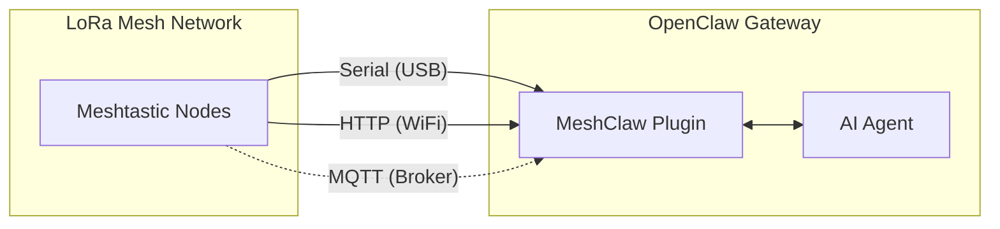

# MeshClaw: OpenClaw Meshtastic チャンネルプラグイン

<p align="center">
  <a href="https://www.npmjs.com/package/@seeed-studio/meshtastic">
    
  </a>
  <a href="https://www.npmjs.com/package/@seeed-studio/meshtastic">
    
  </a>
</p>

<!-- LANG_SWITCHER_START -->
<p align="center">
  <a href="README.md">English</a> | <a href="README.zh-CN.md">中文</a> | <b>日本語</b> | <a href="README.fr.md">Français</a> | <a href="README.pt.md">Português</a> | <a href="README.es.md">Español</a>
</p>
<!-- LANG_SWITCHER_END -->

<p align="center">
  
</p>

MeshClaw は、AI ゲートウェイを Meshtastic LoRa メッシュネットワークに Serial（USB）、HTTP（WiFi）、MQTT 経由で接続する OpenClaw チャンネルプラグインです。

> [!IMPORTANT]
> このリポジトリは **OpenClaw チャンネルプラグイン**であり、スタンドアロンアプリケーションではありません。ご利用には、稼働中の [OpenClaw](https://github.com/openclaw/openclaw) ゲートウェイ（Node.js 22+）が必要です。

[Meshtastic docs][docs] · [Report bug][issues] · [Request feature][issues]

## 目次

- [前提条件](#前提条件)
- [クイックスタート](#クイックスタート)
- [仕組み](#仕組み)
- [主な機能](#主な機能)
- [トランスポートモード](#トランスポートモード)
- [アクセス制御](#アクセス制御)
- [設定](#設定)
- [デモ](#デモ)
- [推奨ハードウェア](#推奨ハードウェア)
- [トラブルシューティング](#トラブルシューティング)
- [制限事項](#制限事項)
- [開発](#開発)
- [コントリビューション](#コントリビューション)
- [ライセンス](#ライセンス)

## 前提条件

- OpenClaw ゲートウェイのインストールおよび稼働
- Node.js 22+
- Meshtastic 接続方法のいずれか:
  - USB 経由の Serial デバイス、または
  - LAN 上の HTTP 対応 Meshtastic デバイス、または
  - MQTT broker へのアクセス（ローカルハードウェア不要）

## クイックスタート

```bash
# 1) Install plugin from npm
openclaw plugins install @seeed-studio/meshtastic

# 2) Run guided setup
openclaw onboard

# 3) Verify channel status
openclaw channels status --probe
```

<p align="center">
  
</p>

## 仕組み



受信メッセージは DM/グループポリシーのチェックを経てから AI Agent に届きます。送信返信はプレーンテキストに変換され、無線送信に適したサイズに分割されます。

## 主な機能

- **3 種類のトランスポート**: Serial、HTTP、MQTT
- **DM ポリシー制御**: `pairing`、`open`、または `allowlist`
- **グループポリシー制御**: `disabled`、`open`、または `allowlist`
- **@mention ゲーティング**: メンションされた場合のみグループで返信（オプション）
- **マルチアカウント対応**: 複数の独立した Meshtastic 接続を実行可能
- **回復性のあるトランスポート処理**: 不安定なリンクでの再接続動作

## トランスポートモード

| モード | 用途 | 必須項目 |
|---|---|---|
| `serial` | USB 接続のローカルノード | `transport`、`serialPort` |
| `http` | ローカルネットワーク到達可能なノード | `transport`、`httpAddress` |
| `mqtt` | ローカルハードウェア不要、共有 broker | `transport`、`mqtt.*`、`nodeName` |

注意:
- `serial` がデフォルトのトランスポートです。
- `mqtt` のデフォルト: broker `mqtt.meshtastic.org`、topic `msh/US/2/json/#`。
- リージョン設定は Serial/HTTP に適用されます。MQTT は topic からリージョンを導出します。

## アクセス制御

### DM ポリシー (`dmPolicy`)

| 値 | 動作 |
|---|---|
| `pairing`（デフォルト） | 新規ユーザーは DM チャット開始前に承認が必要 |
| `open` | 任意のノードが DM 可能 |
| `allowlist` | `allowFrom` に含まれる ID のみ DM 可能 |

### グループポリシー (`groupPolicy`)

| 値 | 動作 |
|---|---|
| `disabled`（デフォルト） | グループチャンネルを無視 |
| `open` | すべてのグループチャンネルで応答 |
| `allowlist` | 設定済みチャンネルのみで応答 |

チャンネルごとにメンションを必須にすることも可能（`requireMention`）で、明示的にタグ付けされた場合のみボットが返信します。

## 設定

ガイド付きセットアップには `openclaw onboard`、または手動で設定を編集するには `openclaw config edit` を使用してください。

### Serial (USB)

```yaml
channels:
  meshtastic:
    transport: serial
    serialPort: /dev/ttyUSB0
    nodeName: OpenClaw
```

### HTTP (WiFi)

```yaml
channels:
  meshtastic:
    transport: http
    httpAddress: meshtastic.local
    nodeName: OpenClaw
```

### MQTT (Broker)

```yaml
channels:
  meshtastic:
    transport: mqtt
    nodeName: OpenClaw
    mqtt:
      broker: mqtt.meshtastic.org
      username: meshdev
      password: large4cats
      topic: "msh/US/2/json/#"
```

### マルチアカウント

```yaml
channels:
  meshtastic:
    accounts:
      home:
        transport: serial
        serialPort: /dev/ttyUSB0
      remote:
        transport: mqtt
        mqtt:
          broker: mqtt.meshtastic.org
          topic: "msh/US/2/json/#"
```

<details>
<summary><b>設定リファレンス</b></summary>

| キー | タイプ | デフォルト | 備考 |
|---|---|---|---|
| `transport` | `serial \| http \| mqtt` | `serial` | ベースとなるトランスポート |
| `serialPort` | `string` | - | `serial` に必須 |
| `httpAddress` | `string` | `meshtastic.local` | `http` に必須 |
| `httpTls` | `boolean` | `false` | HTTP TLS |
| `mqtt.broker` | `string` | `mqtt.meshtastic.org` | MQTT broker ホスト |
| `mqtt.port` | `number` | `1883` | MQTT ポート |
| `mqtt.username` | `string` | `meshdev` | MQTT ユーザー名 |
| `mqtt.password` | `string` | `large4cats` | MQTT パスワード |
| `mqtt.topic` | `string` | `msh/US/2/json/#` | 購読トピック |
| `mqtt.publishTopic` | `string` | 自動導出 | オプションによる上書き |
| `mqtt.tls` | `boolean` | `false` | MQTT TLS |
| `region` | enum | `UNSET` | Serial/HTTP のみ |
| `nodeName` | `string` | 自動検出 | MQTT に必須 |
| `dmPolicy` | `open \| pairing \| allowlist` | `pairing` | DM アクセスポリシー |
| `allowFrom` | `string[]` | - | DM 許可リスト（例: `!aabbccdd`） |
| `groupPolicy` | `open \| allowlist \| disabled` | `disabled` | グループチャンネルポリシー |
| `channels` | `Record<string, object>` | - | チャンネルごとの上書き設定 |
| `textChunkLimit` | `number` | `200` | 許可範囲: `50-500` |

</details>

<details>
<summary><b>環境変数による上書き</b></summary>

以下の変数はデフォルトアカウントの各項目を上書きします:

| 変数 | 設定キー |
|---|---|
| `MESHTASTIC_TRANSPORT` | `transport` |
| `MESHTASTIC_SERIAL_PORT` | `serialPort` |
| `MESHTASTIC_HTTP_ADDRESS` | `httpAddress` |
| `MESHTASTIC_MQTT_BROKER` | `mqtt.broker` |
| `MESHTASTIC_MQTT_TOPIC` | `mqtt.topic` |

</details>

## デモ

<div align="center">

https://github.com/user-attachments/assets/837062d9-a5bb-4e0a-b7cf-298e4bdf2f7c

</div>

フォールバック: [media/demo.mp4](media/demo.mp4)

## 推奨ハードウェア

<p align="center">
  
</p>

| デバイス | 用途 | リンク |
|---|---|---|
| XIAO ESP32S3 + Wio-SX1262 キット | 入門用開発 | [購入][hw-xiao] |
| Wio Tracker L1 Pro | 持ち運び可能なフィールドゲートウェイ | [購入][hw-wio] |
| SenseCAP Card Tracker T1000-E | コンパクトなトラッカー | [購入][hw-sensecap] |

Meshtastic 対応デバイスであればどれでも動作します。MQTT モードはローカルハードウェアなしで実行可能です。

## トラブルシューティング

| 症状 | 確認項目 |
|---|---|
| Serial が接続できない | `serialPort` は正しいですか？ホストにデバイス権限はありますか？ |
| HTTP が接続できない | `httpAddress` に到達可能ですか？`httpTls` は正しく設定されていますか？ |
| MQTT でメッセージを受信しない | topic のリージョンは正しいですか？broker の認証情報は有効ですか？ |
| DM 返信がない | `dmPolicy` と `allowFrom` を確認 |
| グループ返信がない | `groupPolicy`、許可リスト、メンション要件を確認 |

issue を作成する際は、トランスポート種別・設定（秘密情報は除く）、および `openclaw channels status --probe` の出力を添えてください。

## 制限事項

- LoRa メッセージは帯域制限があります。返信は分割されます（`textChunkLimit`、デフォルト `200`）。
- リッチなマークダウンは無線デバイスへ送信前に除去されます。
- メッシュ品質、範囲、レイテンシは無線環境およびネットワーク条件に依存します。

## 開発

```bash
git clone https://github.com/Seeed-Solution/openclaw-meshtastic.git
cd openclaw-meshtastic
npm install
openclaw plugins install -l ./openclaw-meshtastic
openclaw channels status --probe
```

ビルドステップは不要です。OpenClaw は `index.ts` から TypeScript ソースを直接読み込みます。

## コントリビューション

- 機能要望やバグ報告は [GitHub Issues][issues] よりお願いします
- Pull Request を歓迎します
- 既存の TypeScript 規約に準拠した変更をお願いします

## ライセンス

MIT

<!-- Reference-style links -->
[docs]: https://meshtastic.org/docs/
[issues]: https://github.com/Seeed-Solution/openclaw-meshtastic/issues
[hw-xiao]: https://www.seeedstudio.com/Wio-SX1262-with-XIAO-ESP32S3-p-5982.html
[hw-wio]: https://www.seeedstudio.com/Wio-Tracker-L1-Pro-p-6454.html
[hw-sensecap]: https://www.seeedstudio.com/SenseCAP-Card-Tracker-T1000-E-for-Meshtastic-p-5913.html