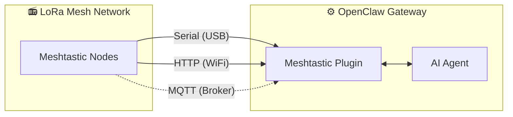

<p align="center">
  
</p>

# MeshClaw: OpenClaw Meshtastic チャンネルプラグイン

<p align="center">
  <a href="https://www.npmjs.com/package/@seeed-studio/meshtastic">
    
  </a>
  <a href="https://www.npmjs.com/package/@seeed-studio/meshtastic">
    
  </a>
</p>

<!-- LANG_SWITCHER_START -->
<p align="center">
  <a href="README.md">English</a> | <a href="README.zh-CN.md">中文</a> | <b>日本語</b> | <a href="README.fr.md">Français</a> | <a href="README.pt.md">Português</a> | <a href="README.es.md">Español</a>
</p>
<!-- LANG_SWITCHER_END -->

**MeshClaw** は OpenClaw のチャンネルプラグインです。AI ゲートウェイが Meshtastic を介してメッセージの送受信を行えるようにし、インターネットや携帯基地局がなくても電波だけで通信できます。山や海、電波の届かない場所からでも AI アシスタントと会話できます。

⭐ GitHub で Star を付けていただけると励みになります！

> [!IMPORTANT]
> これは [OpenClaw](https://github.com/openclaw/openclaw) AI ゲートウェイの **チャンネルプラグイン** です。スタンドアロンアプリではありません。利用には OpenClaw インスタンス（Node.js 22+）が必要です。

[ドキュメント][docs] · [ハードウェアガイド](#推奨ハードウェア) · [バグ報告][issues] · [機能リクエスト][issues]

## 目次

- [動作概要](#動作概要)
- [推奨ハードウェア](#推奨ハードウェア)
- [機能](#機能)
- [対応機能とロードマップ](#対応機能とロードマップ)
- [デモ](#デモ)
- [クイックスタート](#クイックスタート)
- [セットアップウィザード](#セットアップウィザード)
- [設定](#設定)
- [トラブルシューティング](#トラブルシューティング)
- [開発](#開発)
- [コントリビューション](#コントリビューション)

## 動作概要



このプラグインは Meshtastic LoRa デバイスと OpenClaw AI Agent を橋渡しします。3 つのトランスポートモードをサポートします。

- **Serial** — ローカルの Meshtastic デバイスへの USB 直接接続
- **HTTP** — WiFi / ローカルネットワーク経由でのデバイス接続
- **MQTT** — Meshtastic MQTT broker の購読。ローカルハードウェアは不要です

受信メッセージはアクセス制御（DM ポリシー、グループポリシー、@mention ゲーティング）を経て AI に届きます。送信応答はマークダウン書式を除去（LoRa デバイスはレンダリングできないため）し、無線パケットサイズ制限に収まるよう分割されます。

## 推奨ハードウェア

<p align="center">
  
</p>

| デバイス                      | 用途                    | リンク             |
| ----------------------------- | ----------------------- | ------------------ |
| XIAO ESP32S3 + Wio-SX1262 kit | 入門開発用              | [購入][hw-xiao]    |
| Wio Tracker L1 Pro            | ポータブルな現場ゲートウェイ用 | [購入][hw-wio]     |
| SenseCAP Card Tracker T1000-E | コンパクトなトラッカー  | [購入][hw-sensecap] |

ハードウェアがない場合でも、MQTT トランスポートを使用すれば broker 経由で接続可能です — ローカルデバイスは不要です。

Meshtastic 対応デバイスであれば動作します。

## 機能

- **AI Agent との統合** — OpenClaw AI Agent と Meshtastic LoRa メッシュネットワークを橋渡しします。クラウド依存なしでのインテリジェント通信を実現します。

- **3 つのトランスポートモード** — Serial（USB）、HTTP（WiFi）、MQTT をサポート

- **DM とグループチャンネルのアクセス制御** — DM 許可リスト、チャンネル応答ルール、@mention ゲーティングを備えた両方の会話モードをサポート

- **マルチアカウント対応** — 複数の独立した接続を同時に実行可能

- **耐障害性のあるメッシュ通信** — 設定可能な再試行による自動再接続。接続断を適切に処理します。

## 対応機能とロードマップ

このプラグインは Meshtastic を Telegram や Discord と同様の第一級のチャンネルとして扱い、インターネット依存なしで LoRa 無線を介した AI 会話やスキル呼び出しを可能にします。

| オフライン情報クエリ                                          | クロスチャンネルブリッジ：オフグリッドから送信、どこでも受信 | 🔜 今後の予定：                                               |
| ------------------------------------------------------------ | ------------------------------------------------------------ | ------------------------------------------------------------ |
|  |     | リアルタイムのノードデータ（GPS 位置情報、環境センサー、デバイス状態）を OpenClaw のコンテキストに取り込み、AI がメッシュネットワークの健全性を監視し、ユーザーのクエリを待たずに能動的にアラートを発信できるようにする予定です。 |

## デモ

<div align="center">

https://github.com/user-attachments/assets/837062d9-a5bb-4e0a-b7cf-298e4bdf2f7c

</div>

フォールバック: [media/demo.mp4](media/demo.mp4)

## クイックスタート

```bash
# 1. プラグインのインストール
openclaw plugins install @seeed-studio/meshtastic

# 2. ガイド付きセットアップ — トランスポート、リージョン、アクセスポリシーを順に設定
openclaw onboard

# 3. 動作確認
openclaw channels status --probe
```

<p align="center">
  
</p>

## セットアップウィザード

`openclaw onboard` を実行すると、対話式ウィザードが起動し、各設定ステップを順に案内します。以下は各ステップの意味と選択方法です。

### 1. トランスポート

ゲートウェイが Meshtastic メッシュに接続する方法です：

| オプション            | 説明                                                  | 必要なもの                                         |
| ----------------- | ------------------------------------------------------------ | ------------------------------------------------ |
| **Serial** (USB)  | ローカルデバイスへの USB 直接接続。利用可能なポートを自動検出します。 | USB 接続された Meshtastic デバイス             |
| **HTTP** (WiFi)   | ローカルネットワーク経由でのデバイス接続。                 | デバイスの IP アドレスまたはホスト名（例：`meshtastic.local`）  |
| **MQTT** (broker) | MQTT broker 経由でメッシュに接続 — ローカルハードウェアは不要です。 | Broker アドレス、認証情報、および購読トピック |

### 2. LoRa リージョン

> Serial と HTTP のみ。MQTT は購読トピックからリージョンを導出します。

デバイスの無線周波数リージョンを設定します。現地の規制およびメッシュ内の他のノードと一致させる必要があります。一般的な選択肢：

| リージョン   | 周波数           |
| -------- | ------------------- |
| `US`     | 902–928 MHz         |
| `EU_868` | 869 MHz             |
| `CN`     | 470–510 MHz         |
| `JP`     | 920 MHz             |
| `UNSET`  | デバイスのデフォルトを維持 |

完全なリストは [Meshtastic リージョンのドキュメント](https://meshtastic.org/docs/getting-started/initial-config/#lora) を参照してください。

### 3. ノード名

メッシュ上でのデバイスの表示名です。また、グループチャンネルでの **@mention トリガー** としても機能します — 他のユーザーは `@OpenClaw` を送信してボットと会話します。

- **Serial / HTTP**: オプション — 空欄の場合、接続されたデバイスから自動検出します。
- **MQTT**: 必須 — 物理デバイスがないため名前を読み取れません。

### 4. チャンネルアクセス (`groupPolicy`)

**メッシュグループチャンネル**（例：LongFast、Emergency）でボットが応答するかどうか、およびその方法を制御します：

| ポリシー               | 動作                                                     |
| -------------------- | ------------------------------------------------------------ |
| `disabled` (デフォルト) | すべてのグループチャンネルメッセージを無視します。DM のみ処理します。  |
| `open`               | メッシュ上の **すべて** のチャンネルで応答します。                   |
| `allowlist`          | **リストに含まれる** チャンネルのみで応答します。チャンネル名を入力するように求められます（カンマ区切り、例：`LongFast, Emergency`）。`*` をワイルドカードとして使用してすべてにマッチさせることもできます。 |

### 5. @mention の要求

> チャンネルアクセスが有効な場合（`disabled` 以外）にのみ表示されます。

有効にすると（デフォルト：**はい**）、ボットは自分のノード名がメンションされた場合（例：`@OpenClaw 天気はどう？`）にのみグループチャンネルで応答します。これにより、ボットがチャンネルのすべてのメッセージに返信するのを防ぎます。

無効にすると、ボットは許可されたチャンネルの **すべて** のメッセージに応答します。

### 6. DM アクセスポリシー (`dmPolicy`)

**ダイレクトメッセージ**をボットに送信できるユーザーを制御します：

| ポリシー              | 動作                                                     |
| ------------------- | ------------------------------------------------------------ |
| `pairing` (デフォルト) | 新規送信者はペアリングリクエストをトリガーし、チャットする前に承認が必要です。 |
| `open`              | メッシュ上の誰でも自由に DM を送信できます。                    |
| `allowlist`         | `allowFrom` にリストされたノードのみが DM を送信できます。それ以外は無視されます。 |

### 7. DM 許可リスト (`allowFrom`)

> `dmPolicy` が `allowlist` の場合、またはウィザードが必要と判断した場合にのみ表示されます。

ダイレクトメッセージを送信できる Meshtastic ユーザー ID のリストです。形式：`!aabbccdd`（16 進数のユーザー ID）。複数のエントリはカンマ区切りです。

<p align="center">
  
</p>

### 8. アカウントの表示名

> マルチアカウント設定の場合にのみ表示されます。オプションです。

アカウントに人間が読める表示名を割り当てます。例えば、ID が `home` のアカウントを「Home Station」と表示できます。スキップした場合は生のアカウント ID がそのまま使用されます。これは純粋に表示上のものであり、機能に影響はありません。

## 設定

ガイド付きセットアップ（`openclaw onboard`）で以下すべてをカバーします。手順については [セットアップウィザード](#セットアップウィザード) を参照してください。手動で設定する場合は、`openclaw config edit` で編集してください。

### Serial (USB)

```yaml
channels:
  meshtastic:
    transport: serial
    serialPort: /dev/ttyUSB0
    nodeName: OpenClaw
```

### HTTP (WiFi)

```yaml
channels:
  meshtastic:
    transport: http
    httpAddress: meshtastic.local
    nodeName: OpenClaw
```

### MQTT (broker)

```yaml
channels:
  meshtastic:
    transport: mqtt
    nodeName: OpenClaw
    mqtt:
      broker: mqtt.meshtastic.org
      username: meshdev
      password: large4cats
      topic: "msh/US/2/json/#"
```

### マルチアカウント

```yaml
channels:
  meshtastic:
    accounts:
      home:
        transport: serial
        serialPort: /dev/ttyUSB0
      remote:
        transport: mqtt
        mqtt:
          broker: mqtt.meshtastic.org
          topic: "msh/US/2/json/#"
```

<details>
<summary><b>すべてのオプションリファレンス</b></summary>

| キー                 | 型                            | デフォルト               | 備考                                                        |
| ------------------- | ------------------------------- | --------------------- | ------------------------------------------------------------ |
| `transport`         | `serial \| http \| mqtt`        | `serial`              |                                                              |
| `serialPort`        | `string`                        | —                     | Serial で必須                                          |
| `httpAddress`       | `string`                        | `meshtastic.local`    | HTTP で必須                                            |
| `httpTls`           | `boolean`                       | `false`               |                                                              |
| `mqtt.broker`       | `string`                        | `mqtt.meshtastic.org` |                                                              |
| `mqtt.port`         | `number`                        | `1883`                |                                                              |
| `mqtt.username`     | `string`                        | `meshdev`             |                                                              |
| `mqtt.password`     | `string`                        | `large4cats`          |                                                              |
| `mqtt.topic`        | `string`                        | `msh/US/2/json/#`     | 購読トピック                                              |
| `mqtt.publishTopic` | `string`                        | derived               |                                                              |
| `mqtt.tls`          | `boolean`                       | `false`               |                                                              |
| `region`            | enum                            | `UNSET`               | `US`, `EU_868`, `CN`, `JP`, `ANZ`, `KR`, `TW`, `RU`, `IN`, `NZ_865`, `TH`, `EU_433`, `UA_433`, `UA_868`, `MY_433`, `MY_919`, `SG_923`, `LORA_24`。Serial/HTTP のみ。 |
| `nodeName`          | `string`                        | auto-detect           | 表示名および @mention トリガー。MQTT では必須。        |
| `dmPolicy`          | `open \| pairing \| allowlist`  | `pairing`             | DM を送信できるユーザー。[DM アクセスポリシー](#6-dm-アクセスポリシー-dmpolicy) を参照。 |
| `allowFrom`         | `string[]`                      | —                     | DM 許可リストのノード ID、例：`["!aabbccdd"]`              |
| `groupPolicy`       | `open \| allowlist \| disabled` | `disabled`            | グループチャンネルの応答ポリシー。[チャンネルアクセス](#4-チャンネルアクセス-grouppolicy) を参照。 |
| `channels`          | `Record<string, object>`        | —                     | チャンネルごとの上書き設定：`requireMention`, `allowFrom`, `tools` |

</details>

<details>
<summary><b>環境変数による上書き</b></summary>

これらはデフォルトアカウントの設定を上書きします（YAML は名前付きアカウントで優先されます）：

| 変数                  | 対応する設定キー |
| ------------------------- | --------------------- |
| `MESHTASTIC_TRANSPORT`    | `transport`           |
| `MESHTASTIC_SERIAL_PORT`  | `serialPort`          |
| `MESHTASTIC_HTTP_ADDRESS` | `httpAddress`         |
| `MESHTASTIC_MQTT_BROKER`  | `mqtt.broker`         |
| `MESHTASTIC_MQTT_TOPIC`   | `mqtt.topic`          |

</details>

## トラブルシューティング

| 症状               | 確認項目                                                        |
| --------------------- | ------------------------------------------------------------ |
| Serial が接続できない  | デバイスパスは正しいですか？ホストに権限がありますか？                    |
| HTTP が接続できない    | `httpAddress` に到達可能ですか？`httpTls` はデバイスと一致していますか？           |
| MQTT で何も受信できない | `mqtt.topic` のリージョンは正しいですか？Broker の認証情報は有効ですか？    |
| DM の応答がない       | `dmPolicy` と `allowFrom` は設定されていますか？[DM アクセスポリシー](#6-dm-アクセスポリシー-dmpolicy) を参照してください。 |
| グループ返信がない      | `groupPolicy` は有効ですか？チャンネルは許可リストに含まれていますか？@mention は必要ですか？[チャンネルアクセス](#4-チャンネルアクセス-grouppolicy) を参照してください。 |

バグを発見しましたか？[issue を作成][issues] する際は、トランスポート種別、設定（秘密情報は除く）、および `openclaw channels status --probe` の出力を添えてください。

## 開発

```bash
git clone https://github.com/Seeed-Solution/MeshClaw.git
cd MeshClaw
npm install
openclaw plugins install -l ./MeshClaw
```

ビルドステップはありません — OpenClaw は TypeScript ソースを直接読み込みます。`openclaw channels status --probe` で確認してください。

## コントリビューション

- バグ報告や機能リクエストは [issue を作成][issues] してください
- Pull Request を歓迎します — 既存の TypeScript 規約に沿ったコードを維持してください

<!-- Reference-style links -->
[docs]: https://meshtastic.org/docs/
[issues]: https://github.com/Seeed-Solution/MeshClaw/issues
[hw-xiao]: https://www.seeedstudio.com/Wio-SX1262-with-XIAO-ESP32S3-p-5982.html
[hw-wio]: https://www.seeedstudio.com/Wio-Tracker-L1-Pro-p-6454.html
[hw-sensecap]: https://www.seeedstudio.com/SenseCAP-Card-Tracker-T1000-E-for-Meshtastic-p-5913.html