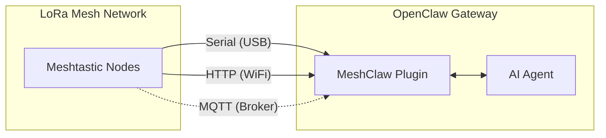

# MeshClaw: OpenClaw Meshtastic Channel Plugin

<p align="center">
  <a href="https://www.npmjs.com/package/@seeed-studio/meshtastic">
    
  </a>
  <a href="https://www.npmjs.com/package/@seeed-studio/meshtastic">
    
  </a>
</p>

<p align="center">
  <a href="README.md"><b>English</b></a> | <a href="README.zh-CN.md">中文</a>
</p>

<p align="center">
  
</p>

MeshClaw is an OpenClaw channel plugin that connects your AI gateway to Meshtastic LoRa mesh networks over Serial (USB), HTTP (WiFi), or MQTT.

> [!IMPORTANT]
> This repository is an **OpenClaw channel plugin**, not a standalone app.
> You need a running [OpenClaw](https://github.com/openclaw/openclaw) gateway (Node.js 22+) to use it.

[Meshtastic docs][docs] · [Report bug][issues] · [Request feature][issues]

## Table of Contents

- [Prerequisites](#prerequisites)
- [Quick Start](#quick-start)
- [How It Works](#how-it-works)
- [Key Features](#key-features)
- [Transport Modes](#transport-modes)
- [Access Control](#access-control)
- [Configuration](#configuration)
- [Demo](#demo)
- [Recommended Hardware](#recommended-hardware)
- [Troubleshooting](#troubleshooting)
- [Limitations](#limitations)
- [Development](#development)
- [Contributing](#contributing)
- [License](#license)

## Prerequisites

- OpenClaw gateway installed and running
- Node.js 22+
- One Meshtastic connection method:
  - Serial device via USB, or
  - HTTP-enabled Meshtastic device on LAN, or
  - MQTT broker access (no local hardware required)

## Quick Start

```bash
# 1) Install plugin from npm
openclaw plugins install @seeed-studio/meshtastic

# 2) Run guided setup
openclaw onboard

# 3) Verify channel status
openclaw channels status --probe
```

<p align="center">
  
</p>

## How It Works



Inbound messages pass through DM/group policy checks before reaching the AI agent.
Outbound replies are converted to plain text and chunked for radio delivery.

## Key Features

- **Three transports**: Serial, HTTP, and MQTT
- **DM policy controls**: `pairing`, `open`, or `allowlist`
- **Group policy controls**: `disabled`, `open`, or `allowlist`
- **Mention gating**: only reply in groups when mentioned (optional)
- **Multi-account support**: run multiple independent Meshtastic connections
- **Resilient transport handling**: reconnect behavior for unstable links

## Transport Modes

| Mode | Best for | Required fields |
|---|---|---|
| `serial` | Local USB-connected node | `transport`, `serialPort` |
| `http` | Node reachable on local network | `transport`, `httpAddress` |
| `mqtt` | No local hardware, shared broker | `transport`, `mqtt.*`, `nodeName` |

Notes:
- `serial` is the default transport.
- `mqtt` defaults: broker `mqtt.meshtastic.org`, topic `msh/US/2/json/#`.
- Region setting applies to Serial/HTTP; MQTT derives region from topic.

## Access Control

### DM Policy (`dmPolicy`)

| Value | Behavior |
|---|---|
| `pairing` (default) | New users require approval before DM chats |
| `open` | Any node can DM |
| `allowlist` | Only IDs in `allowFrom` can DM |

### Group Policy (`groupPolicy`)

| Value | Behavior |
|---|---|
| `disabled` (default) | Ignore group channels |
| `open` | Respond in all group channels |
| `allowlist` | Respond only in configured channels |

You can also require mention per channel (`requireMention`) so the bot only replies when explicitly tagged.

## Configuration

Use `openclaw onboard` for guided setup, or edit config manually with `openclaw config edit`.

### Serial (USB)

```yaml
channels:
  meshtastic:
    transport: serial
    serialPort: /dev/ttyUSB0
    nodeName: OpenClaw
```

### HTTP (WiFi)

```yaml
channels:
  meshtastic:
    transport: http
    httpAddress: meshtastic.local
    nodeName: OpenClaw
```

### MQTT (Broker)

```yaml
channels:
  meshtastic:
    transport: mqtt
    nodeName: OpenClaw
    mqtt:
      broker: mqtt.meshtastic.org
      username: meshdev
      password: large4cats
      topic: "msh/US/2/json/#"
```

### Multi-account

```yaml
channels:
  meshtastic:
    accounts:
      home:
        transport: serial
        serialPort: /dev/ttyUSB0
      remote:
        transport: mqtt
        mqtt:
          broker: mqtt.meshtastic.org
          topic: "msh/US/2/json/#"
```

<details>
<summary><b>Configuration reference</b></summary>

| Key | Type | Default | Notes |
|---|---|---|---|
| `transport` | `serial \| http \| mqtt` | `serial` | Base transport |
| `serialPort` | `string` | - | Required for `serial` |
| `httpAddress` | `string` | `meshtastic.local` | Required for `http` |
| `httpTls` | `boolean` | `false` | HTTP TLS |
| `mqtt.broker` | `string` | `mqtt.meshtastic.org` | MQTT broker host |
| `mqtt.port` | `number` | `1883` | MQTT port |
| `mqtt.username` | `string` | `meshdev` | MQTT username |
| `mqtt.password` | `string` | `large4cats` | MQTT password |
| `mqtt.topic` | `string` | `msh/US/2/json/#` | Subscribe topic |
| `mqtt.publishTopic` | `string` | derived | Optional override |
| `mqtt.tls` | `boolean` | `false` | MQTT TLS |
| `region` | enum | `UNSET` | Serial/HTTP only |
| `nodeName` | `string` | auto-detect | Required for MQTT |
| `dmPolicy` | `open \| pairing \| allowlist` | `pairing` | DM access policy |
| `allowFrom` | `string[]` | - | DM allowlist, e.g. `!aabbccdd` |
| `groupPolicy` | `open \| allowlist \| disabled` | `disabled` | Group channel policy |
| `channels` | `Record<string, object>` | - | Per-channel overrides |
| `textChunkLimit` | `number` | `200` | Allowed range: `50-500` |

</details>

<details>
<summary><b>Environment variable overrides</b></summary>

These variables override default-account fields:

| Variable | Config key |
|---|---|
| `MESHTASTIC_TRANSPORT` | `transport` |
| `MESHTASTIC_SERIAL_PORT` | `serialPort` |
| `MESHTASTIC_HTTP_ADDRESS` | `httpAddress` |
| `MESHTASTIC_MQTT_BROKER` | `mqtt.broker` |
| `MESHTASTIC_MQTT_TOPIC` | `mqtt.topic` |

</details>

## Demo

<div align="center">

https://github.com/user-attachments/assets/837062d9-a5bb-4e0a-b7cf-298e4bdf2f7c

</div>

Fallback: [media/demo.mp4](media/demo.mp4)

## Recommended Hardware

<p align="center">
  
</p>

| Device | Best for | Link |
|---|---|---|
| XIAO ESP32S3 + Wio-SX1262 kit | Entry-level development | [Buy][hw-xiao] |
| Wio Tracker L1 Pro | Portable field gateway | [Buy][hw-wio] |
| SenseCAP Card Tracker T1000-E | Compact tracker | [Buy][hw-sensecap] |

Any Meshtastic-compatible device works. MQTT mode can run without local hardware.

## Troubleshooting

| Symptom | Check |
|---|---|
| Serial cannot connect | Is `serialPort` correct? Does host have device permission? |
| HTTP cannot connect | Is `httpAddress` reachable? Is `httpTls` set correctly? |
| MQTT receives no messages | Is topic region correct? Are broker credentials valid? |
| No DM replies | Check `dmPolicy` and `allowFrom` |
| No group replies | Check `groupPolicy`, allowlist, and mention requirement |

When filing an issue, include transport mode, redacted config, and `openclaw channels status --probe` output.

## Limitations

- LoRa messages are bandwidth-constrained; replies are chunked (`textChunkLimit`, default `200`).
- Rich markdown is stripped before sending to radio devices.
- Mesh quality, range, and latency depend on radio environment and network conditions.

## Development

```bash
git clone https://github.com/Seeed-Solution/openclaw-meshtastic.git
cd openclaw-meshtastic
npm install
openclaw plugins install -l ./openclaw-meshtastic
openclaw channels status --probe
```

No build step is required. OpenClaw loads TypeScript source directly from `index.ts`.

## Contributing

- Open issues and feature requests via [GitHub Issues][issues]
- Pull requests are welcome
- Keep changes aligned with existing TypeScript conventions

## License

MIT

<!-- Reference-style links -->
[docs]: https://meshtastic.org/docs/
[issues]: https://github.com/Seeed-Solution/openclaw-meshtastic/issues
[hw-xiao]: https://www.seeedstudio.com/Wio-SX1262-with-XIAO-ESP32S3-p-5982.html
[hw-wio]: https://www.seeedstudio.com/Wio-Tracker-L1-Pro-p-6454.html
[hw-sensecap]: https://www.seeedstudio.com/SenseCAP-Card-Tracker-T1000-E-for-Meshtastic-p-5913.html
