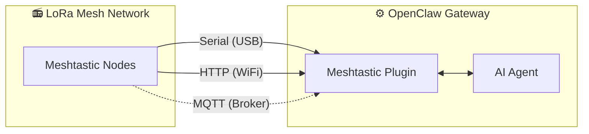

# MeshClaw: OpenClaw Meshtastic Channel Plugin

<p align="center">
  
</p>

[](https://www.npmjs.com/package/@seeed-studio/meshtastic)
[](https://www.npmjs.com/package/@seeed-studio/meshtastic)

**[English](README.md)** | [中文](README.zh-CN.md)

**MeshClaw** is an OpenClaw channel plugin that lets your AI gateway send and receive messages over Meshtastic — no internet, no cell towers, just radio waves. Talk to your AI assistant from the mountains, the ocean, or anywhere the grid doesn't reach.

⭐ Star us on GitHub — it motivates us a lot!

> [!IMPORTANT]
> This is a **channel plugin** for the [OpenClaw](https://github.com/openclaw/openclaw) AI gateway — not a standalone application. You need a running OpenClaw instance (Node.js 22+) to use it.

[Documentation][docs] · [Hardware Guide](#recommended-hardware) · [Report Bug][issues] · [Request Feature][issues]


## Table of Contents

- [How It Works](#how-it-works)
- [Recommended Hardware](#recommended-hardware)
- [Features](#features)
- [Capabilities & Roadmap](#Capabilities & Roadmap)
- [Demo](#demo)
- [Quick Start](#quick-start)
- [Setup Wizard](#setup-wizard)
- [Configuration](#configuration)
- [Troubleshooting](#troubleshooting)
- [Development](#development)
- [Contributing](#contributing)


## How It Works



The plugin bridges Meshtastic LoRa devices and the OpenClaw AI agent. It supports three transport modes:

- **Serial** — direct USB connection to a local Meshtastic device
- **HTTP** — connects to a device over WiFi / local network
- **MQTT** — subscribes to a Meshtastic MQTT broker, no local hardware needed

Inbound messages go through access control (DM policy, group policy, mention gating) before reaching the AI. Outbound replies are stripped of markdown formatting (LoRa devices can't render it) and chunked to fit radio packet size limits.

## Recommended Hardware

<p align="center">
  
</p>

| Device | Best for | Link |
|---|---|---|
| XIAO ESP32S3 + Wio-SX1262 kit | Entry-level development | [Buy][hw-xiao] |
| Wio Tracker L1 Pro | Portable field gateway | [Buy][hw-wio] |
| SenseCAP Card Tracker T1000-E | Compact tracker | [Buy][hw-sensecap] |

No hardware? MQTT transport connects via broker — no local device required.

Any Meshtastic-compatible device works.

## Features

● **AI Agent Integration** — Bridges OpenClaw AI agents with Meshtastic LoRa mesh networks. Enables intelligent communication without cloud dependency.

● **Three Transport Modes** — Serial (USB), HTTP (WiFi), and MQTT support

● **DM & Group Channels with Access Control** — Supports both conversation modes with DM allowlists, channel response rules, and mention-gating 

● **Multi-Account Support**— Run multiple independent connections simultaneously

● **Resilient Mesh Communication** — Auto-reconnect with configurable retries. Handles connection drops gracefully.

## Capabilities & Roadmap

The plugin treats Meshtastic as a first-class channel — just like Telegram or Discord — enabling AI conversations and skill invocation entirely over LoRa radio, without internet dependency.

| Query Information Offline                                    | Cross-Channel Bridge: Send from off-grid, receive anywhere | 🔜What's next:                                                |
| ------------------------------------------------------------ | ---------------------------------------------------------- | ------------------------------------------------------------ |
|  |   | We plan to ingest real-time node data (GPS location, environmental sensors, device status) into OpenClaw's context, enabling the AI to monitor mesh network health and broadcast proactive alerts without waiting for user queries. |

## Demo

https://github.com/user-attachments/assets/837062d9-a5bb-4e0a-b7cf-298e4bdf2f7c

Fallback: [media/demo.mp4](media/demo.mp4)

## Quick Start

```bash
# 1. Install plugin
openclaw plugins install @seeed-studio/meshtastic

# 2. Guided setup — walks you through transport, region, and access policy
openclaw onboard

# 3. Verify
openclaw channels status --probe
```

<p align="center">
  
</p>

## Setup Wizard

Running `openclaw onboard` launches an interactive wizard that walks you through each configuration step. Below is what each step means and how to choose.

### 1. Transport

How the gateway connects to the Meshtastic mesh:

| Option | Description | Requires |
|---|---|---|
| **Serial** (USB) | Direct USB connection to a local device. Auto-detects available ports. | Meshtastic device plugged in via USB |
| **HTTP** (WiFi) | Connects to a device over the local network. | Device IP or hostname (e.g. `meshtastic.local`) |
| **MQTT** (broker) | Connects to the mesh via an MQTT broker — no local hardware needed. | Broker address, credentials, and subscribe topic |

### 2. LoRa Region

> Serial and HTTP only. MQTT derives the region from the subscribe topic.

Sets the radio frequency region on the device. Must match your local regulations and other nodes on the mesh. Common choices:

| Region | Frequency |
|---|---|
| `US` | 902–928 MHz |
| `EU_868` | 869 MHz |
| `CN` | 470–510 MHz |
| `JP` | 920 MHz |
| `UNSET` | Keep device default |

See [Meshtastic region docs](https://meshtastic.org/docs/getting-started/initial-config/#lora) for the full list.

### 3. Node Name

The device's display name on the mesh. Also used as the **@mention trigger** in group channels — other users send `@OpenClaw` to talk to your bot.

- **Serial / HTTP**: optional — auto-detects from the connected device if left empty.
- **MQTT**: required — there is no physical device to read the name from.

### 4. Channel Access (`groupPolicy`)

Controls whether and how the bot responds in **mesh group channels** (e.g. LongFast, Emergency):

| Policy | Behavior |
|---|---|
| `disabled` (default) | Ignores all group channel messages. Only DMs are processed. |
| `open` | Responds in **every** channel on the mesh. |
| `allowlist` | Responds only in **listed** channels. You will be prompted to enter channel names (comma-separated, e.g. `LongFast, Emergency`). Use `*` as a wildcard to match all. |

### 5. Require Mention

> Only appears when channel access is enabled (not `disabled`).

When enabled (default: **yes**), the bot only responds in group channels when someone mentions its node name (e.g. `@OpenClaw how's the weather?`). This prevents the bot from replying to every single message in the channel.

When disabled, the bot responds to **all** messages in allowed channels.

### 6. DM Access Policy (`dmPolicy`)

Controls who can send **direct messages** to the bot:

| Policy | Behavior |
|---|---|
| `pairing` (default) | New senders trigger a pairing request that must be approved before they can chat. |
| `open` | Anyone on the mesh can DM the bot freely. |
| `allowlist` | Only nodes listed in `allowFrom` can DM. All others are ignored. |

### 7. DM Allowlist (`allowFrom`)

> Only appears when `dmPolicy` is `allowlist`, or when the wizard determines one is needed.

A list of Meshtastic User IDs allowed to send direct messages. Format: `!aabbccdd` (hex User ID). Multiple entries are comma-separated.
<p align="center">
  
</p>

### 8. Account Display Names

> Only appears for multi-account setups. Optional.

Assigns human-readable display names to your accounts. For example, an account with ID `home` could be displayed as "Home Station". If skipped, the raw account ID is used as-is. This is purely cosmetic and does not affect functionality.

## Configuration

The guided setup (`openclaw onboard`) covers everything below. See [Setup Wizard](#setup-wizard) for a step-by-step walkthrough. For manual config, edit with `openclaw config edit`.

### Serial (USB)

```yaml
channels:
  meshtastic:
    transport: serial
    serialPort: /dev/ttyUSB0
    nodeName: OpenClaw
```

### HTTP (WiFi)

```yaml
channels:
  meshtastic:
    transport: http
    httpAddress: meshtastic.local
    nodeName: OpenClaw
```

### MQTT (broker)

```yaml
channels:
  meshtastic:
    transport: mqtt
    nodeName: OpenClaw
    mqtt:
      broker: mqtt.meshtastic.org
      username: meshdev
      password: large4cats
      topic: "msh/US/2/json/#"
```

### Multi-account

```yaml
channels:
  meshtastic:
    accounts:
      home:
        transport: serial
        serialPort: /dev/ttyUSB0
      remote:
        transport: mqtt
        mqtt:
          broker: mqtt.meshtastic.org
          topic: "msh/US/2/json/#"
```

<details>
<summary><b>All Options Reference</b></summary>

| Key | Type | Default | Notes |
|---|---|---|---|
| `transport` | `serial \| http \| mqtt` | `serial` | |
| `serialPort` | `string` | — | Required for serial |
| `httpAddress` | `string` | `meshtastic.local` | Required for HTTP |
| `httpTls` | `boolean` | `false` | |
| `mqtt.broker` | `string` | `mqtt.meshtastic.org` | |
| `mqtt.port` | `number` | `1883` | |
| `mqtt.username` | `string` | `meshdev` | |
| `mqtt.password` | `string` | `large4cats` | |
| `mqtt.topic` | `string` | `msh/US/2/json/#` | Subscribe topic |
| `mqtt.publishTopic` | `string` | derived | |
| `mqtt.tls` | `boolean` | `false` | |
| `region` | enum | `UNSET` | `US`, `EU_868`, `CN`, `JP`, `ANZ`, `KR`, `TW`, `RU`, `IN`, `NZ_865`, `TH`, `EU_433`, `UA_433`, `UA_868`, `MY_433`, `MY_919`, `SG_923`, `LORA_24`. Serial/HTTP only. |
| `nodeName` | `string` | auto-detect | Display name and @mention trigger. Required for MQTT. |
| `dmPolicy` | `open \| pairing \| allowlist` | `pairing` | Who can send direct messages. See [DM Access Policy](#6-dm-access-policy-dmpolicy). |
| `allowFrom` | `string[]` | — | Node IDs for DM allowlist, e.g. `["!aabbccdd"]` |
| `groupPolicy` | `open \| allowlist \| disabled` | `disabled` | Group channel response policy. See [Channel Access](#4-channel-access-grouppolicy). |
| `channels` | `Record<string, object>` | — | Per-channel overrides: `requireMention`, `allowFrom`, `tools` |

</details>

<details>
<summary><b>Environment Variable Overrides</b></summary>

These override the default account's config (YAML takes precedence for named accounts):

| Variable | Equivalent config key |
|---|---|
| `MESHTASTIC_TRANSPORT` | `transport` |
| `MESHTASTIC_SERIAL_PORT` | `serialPort` |
| `MESHTASTIC_HTTP_ADDRESS` | `httpAddress` |
| `MESHTASTIC_MQTT_BROKER` | `mqtt.broker` |
| `MESHTASTIC_MQTT_TOPIC` | `mqtt.topic` |

</details>

## Troubleshooting

| Symptom | Check |
|---|---|
| Serial won't connect | Device path correct? Host has permission? |
| HTTP won't connect | `httpAddress` reachable? `httpTls` matches device? |
| MQTT receives nothing | Region in `mqtt.topic` correct? Broker credentials valid? |
| No DM responses | `dmPolicy` and `allowFrom` configured? See [DM Access Policy](#6-dm-access-policy-dmpolicy). |
| No group replies | `groupPolicy` enabled? Channel in allowlist? Mention required? See [Channel Access](#4-channel-access-grouppolicy). |

Found a bug? [Open an issue][issues] with transport type, config (redact secrets), and `openclaw channels status --probe` output.

## Development

```bash
git clone https://github.com/Seeed-Solution/openclaw-meshtastic.git
cd openclaw-meshtastic
npm install
openclaw plugins install -l ./openclaw-meshtastic
```

No build step — OpenClaw loads TypeScript source directly. Use `openclaw channels status --probe` to verify.

## Contributing

- [Open an issue][issues] for bugs or feature requests
- Pull requests welcome — keep code aligned with existing TypeScript conventions

<!-- Reference-style links -->
[docs]: https://meshtastic.org/docs/
[issues]: https://github.com/Seeed-Solution/openclaw-meshtastic/issues
[hw-xiao]: https://www.seeedstudio.com/Wio-SX1262-with-XIAO-ESP32S3-p-5982.html
[hw-wio]: https://www.seeedstudio.com/Wio-Tracker-L1-Pro-p-6454.html
[hw-sensecap]: https://www.seeedstudio.com/SenseCAP-Card-Tracker-T1000-E-for-Meshtastic-p-5913.html
