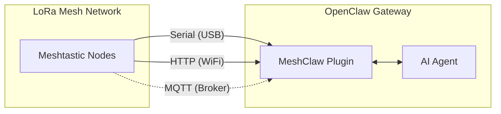

# MeshClaw：OpenClaw Meshtastic 频道插件

<p align="center">
  <a href="https://www.npmjs.com/package/@seeed-studio/meshtastic">
    
  </a>
  <a href="https://www.npmjs.com/package/@seeed-studio/meshtastic">
    
  </a>
</p>

<!-- LANG_SWITCHER_START -->
<p align="center">
  <a href="README.md">English</a> | <b>中文</b> | <a href="README.ja.md">日本語</a> | <a href="README.fr.md">Français</a> | <a href="README.pt.md">Português</a> | <a href="README.es.md">Español</a>
</p>
<!-- LANG_SWITCHER_END -->

<p align="center">
  
</p>

MeshClaw 是 OpenClaw 的频道插件，通过 Serial（USB）、HTTP（WiFi）或 MQTT 将你的 AI 网关接入 Meshtastic LoRa mesh 网络。

> [!IMPORTANT]
> 本仓库是 **OpenClaw 频道插件**，不是独立应用。
> 需要先安装并运行 [OpenClaw](https://github.com/openclaw/openclaw) 网关（Node.js 22+）。

[Meshtastic 文档][docs] · [提交 bug][issues] · [功能请求][issues]

## 目录

- [环境准备](#环境准备)
- [快速开始](#快速开始)
- [工作原理](#工作原理)
- [主要特性](#主要特性)
- [传输方式](#传输方式)
- [访问控制](#访问控制)
- [配置说明](#配置说明)
- [演示](#演示)
- [推荐硬件](#推荐硬件)
- [故障排查](#故障排查)
- [使用限制](#使用限制)
- [开发](#开发)
- [参与贡献](#参与贡献)
- [开源协议](#开源协议)

## 环境准备

- OpenClaw 网关已安装并运行
- Node.js 22+
- 任一种 Meshtastic 连接方式：
  - Serial 设备通过 USB，或
  - 局域网内支持 HTTP 的 Meshtastic 设备，或
  - MQTT broker 访问（无需本地硬件）

## 快速开始

```bash
# 1) Install plugin from npm
openclaw plugins install @seeed-studio/meshtastic

# 2) Run guided setup
openclaw onboard

# 3) Verify channel status
openclaw channels status --probe
```

<p align="center">
  
</p>

## 工作原理



入站消息需通过私信/群组策略检查后才能到达 AI Agent。
出站回复会被转换为纯文本并分块，以便通过无线电发送。

## 主要特性

- **三种传输方式**：Serial、HTTP 和 MQTT
- **私信策略控制**：`pairing`、`open` 或 `allowlist`
- **群组策略控制**：`disabled`、`open` 或 `allowlist`
- **@mention 门控**：仅在群组中被 @ 时才回复（可选）
- **多账号支持**：可同时运行多个独立的 Meshtastic 连接
- **传输容错**：不稳定链路自动重连

## 传输方式

| 传输方式 | 适用场景 | 必填字段 |
|---|---|---|
| `serial` | 本地 USB 连接的节点 | `transport`、`serialPort` |
| `http` | 局域网内可达的节点 | `transport`、`httpAddress` |
| `mqtt` | 无本地硬件，使用共享 broker | `transport`、`mqtt.*`、`nodeName` |

注意：
- `serial` 为默认传输方式。
- `mqtt` 默认值：broker 为 `mqtt.meshtastic.org`，topic 为 `msh/US/2/json/#`。
- Region 设置仅适用于 Serial/HTTP；MQTT 从 topic 中派生 region。

## 访问控制

### 私信策略（`dmPolicy`）

| 取值 | 行为 |
|---|---|
| `pairing`（默认）| 新用户需要批准后才能进行私信聊天 |
| `open` | 任何节点都可发送私信 |
| `allowlist` | 仅 `allowFrom` 中的 ID 可发送私信 |

### 群组策略（`groupPolicy`）

| 取值 | 行为 |
|---|---|
| `disabled`（默认）| 忽略群组频道 |
| `open` | 响应所有群组频道 |
| `allowlist` | 仅在配置的频道中响应 |

也可为每个频道开启 `requireMention`，让 bot 仅在被明确 @ 时才回复。

## 配置说明

使用 `openclaw onboard` 进行引导配置，或使用 `openclaw config edit` 手动编辑配置。

### Serial（USB）

```yaml
channels:
  meshtastic:
    transport: serial
    serialPort: /dev/ttyUSB0
    nodeName: OpenClaw
```

### HTTP（WiFi）

```yaml
channels:
  meshtastic:
    transport: http
    httpAddress: meshtastic.local
    nodeName: OpenClaw
```

### MQTT（Broker）

```yaml
channels:
  meshtastic:
    transport: mqtt
    nodeName: OpenClaw
    mqtt:
      broker: mqtt.meshtastic.org
      username: meshdev
      password: large4cats
      topic: "msh/US/2/json/#"
```

### 多账号配置

```yaml
channels:
  meshtastic:
    accounts:
      home:
        transport: serial
        serialPort: /dev/ttyUSB0
      remote:
        transport: mqtt
        mqtt:
          broker: mqtt.meshtastic.org
          topic: "msh/US/2/json/#"
```

<details>
<summary><b>配置参考</b></summary>

| 配置项 | 类型 | 默认值 | 说明 |
|---|---|---|---|
| `transport` | `serial \| http \| mqtt` | `serial` | 基础传输方式 |
| `serialPort` | `string` | - | `serial` 模式必填 |
| `httpAddress` | `string` | `meshtastic.local` | `http` 模式必填 |
| `httpTls` | `boolean` | `false` | HTTP TLS |
| `mqtt.broker` | `string` | `mqtt.meshtastic.org` | MQTT broker 地址 |
| `mqtt.port` | `number` | `1883` | MQTT 端口 |
| `mqtt.username` | `string` | `meshdev` | MQTT 用户名 |
| `mqtt.password` | `string` | `large4cats` | MQTT 密码 |
| `mqtt.topic` | `string` | `msh/US/2/json/#` | 订阅 topic |
| `mqtt.publishTopic` | `string` | derived | 可选，覆盖默认值 |
| `mqtt.tls` | `boolean` | `false` | MQTT TLS |
| `region` | enum | `UNSET` | 仅 Serial/HTTP 适用 |
| `nodeName` | `string` | auto-detect | MQTT 模式必填 |
| `dmPolicy` | `open \| pairing \| allowlist` | `pairing` | 私信访问策略 |
| `allowFrom` | `string[]` | - | 私信白名单，例如 `!aabbccdd` |
| `groupPolicy` | `open \| allowlist \| disabled` | `disabled` | 群组频道策略 |
| `channels` | `Record<string, object>` | - | 按频道覆盖配置 |
| `textChunkLimit` | `number` | `200` | 允许范围：`50-500` |

</details>

<details>
<summary><b>环境变量覆盖</b></summary>

以下变量可覆盖默认账号的对应字段：

| 变量 | 对应配置项 |
|---|---|
| `MESHTASTIC_TRANSPORT` | `transport` |
| `MESHTASTIC_SERIAL_PORT` | `serialPort` |
| `MESHTASTIC_HTTP_ADDRESS` | `httpAddress` |
| `MESHTASTIC_MQTT_BROKER` | `mqtt.broker` |
| `MESHTASTIC_MQTT_TOPIC` | `mqtt.topic` |

</details>

## 演示

<div align="center">

https://github.com/user-attachments/assets/837062d9-a5bb-4e0a-b7cf-298e4bdf2f7c

</div>

备用：[media/demo.mp4](media/demo.mp4)

## 推荐硬件

<p align="center">
  
</p>

| 设备 | 适用场景 | 链接 |
|---|---|---|
| XIAO ESP32S3 + Wio-SX1262 套件 | 入门级开发 | [购买][hw-xiao] |
| Wio Tracker L1 Pro | 便携野外网关 | [购买][hw-wio] |
| SenseCAP Card Tracker T1000-E | 紧凑型追踪器 | [购买][hw-sensecap] |

任何兼容 Meshtastic 的设备均可使用。MQTT 模式无需本地硬件即可运行。

## 故障排查

| 现象 | 检查项 |
|---|---|
| Serial 无法连接 | `serialPort` 是否正确？主机是否有设备权限？ |
| HTTP 无法连接 | `httpAddress` 是否可达？`httpTls` 是否设置正确？ |
| MQTT 收不到消息 | topic region 是否正确？broker 凭证是否有效？ |
| 无私信回复 | 检查 `dmPolicy` 和 `allowFrom` |
| 无群组回复 | 检查 `groupPolicy`、白名单和 mention 要求 |

提 issue 时请附上传输方式、脱敏后的配置以及 `openclaw channels status --probe` 的输出。

## 使用限制

- LoRa 消息带宽受限，回复会被分块（`textChunkLimit`，默认 `200`）。
- 富文本 markdown 在发送到无线电设备前会被剔除。
- mesh 质量、覆盖范围和延迟取决于无线电环境和网络状况。

## 开发

```bash
git clone https://github.com/Seeed-Solution/openclaw-meshtastic.git
cd openclaw-meshtastic
npm install
openclaw plugins install -l ./openclaw-meshtastic
openclaw channels status --probe
```

无需构建步骤。OpenClaw 直接从 `index.ts` 加载 TypeScript 源码。

## 参与贡献

- 通过 [GitHub Issues][issues] 提交 issue 和功能请求
- 欢迎提交 Pull Request
- 保持与现有 TypeScript 代码风格一致

## 开源协议

MIT

<!-- Reference-style links -->
[docs]: https://meshtastic.org/docs/
[issues]: https://github.com/Seeed-Solution/openclaw-meshtastic/issues
[hw-xiao]: https://www.seeedstudio.com/Wio-SX1262-with-XIAO-ESP32S3-p-5982.html
[hw-wio]: https://www.seeedstudio.com/Wio-Tracker-L1-Pro-p-6454.html
[hw-sensecap]: https://www.seeedstudio.com/SenseCAP-Card-Tracker-T1000-E-for-Meshtastic-p-5913.html