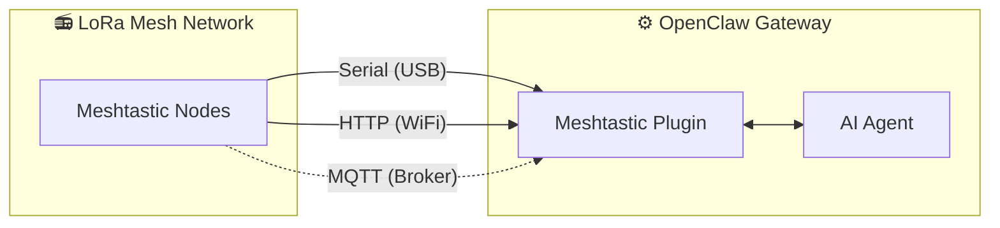

<p align="center">
  
</p>

# MeshClaw：OpenClaw Meshtastic 频道插件

<p align="center">
  <a href="https://www.npmjs.com/package/@seeed-studio/meshtastic">
    
  </a>
  <a href="https://www.npmjs.com/package/@seeed-studio/meshtastic">
    
  </a>
</p>

<!-- LANG_SWITCHER_START -->
<p align="center">
  <a href="README.md">English</a> | <b>中文</b> | <a href="README.ja.md">日本語</a> | <a href="README.fr.md">Français</a> | <a href="README.pt.md">Português</a> | <a href="README.es.md">Español</a>
</p>
<!-- LANG_SWITCHER_END -->

**MeshClaw** 是 OpenClaw 的频道插件，让你的 AI 网关通过 Meshtastic 收发消息——无需互联网，无需基站，只靠无线电波。在深山、海洋或任何没有信号的地方都能与 AI 助手对话。

⭐ 在 GitHub 上给我们点星——这对我们很重要！

> [!IMPORTANT]
> 这是 [OpenClaw](https://github.com/openclaw/openclaw) AI 网关的**频道插件**，不是独立应用。需要先安装并运行 OpenClaw（Node.js 22+）才能使用。

[文档][docs] · [硬件指南](#推荐硬件) · [报告 Bug][issues] · [功能请求][issues]

## 目录

- [工作原理](#工作原理)
- [推荐硬件](#推荐硬件)
- [功能特性](#功能特性)
- [能力与路线图](#能力与路线图)
- [演示](#演示)
- [快速开始](#快速开始)
- [设置向导](#设置向导)
- [配置](#配置)
- [故障排除](#故障排除)
- [开发](#开发)
- [贡献](#贡献)

## 工作原理



该插件桥接 Meshtastic LoRa 设备与 OpenClaw AI Agent，支持三种传输方式：

- **Serial** — USB 直连本地 Meshtastic 设备
- **HTTP** — 通过 WiFi/本地网络连接设备
- **MQTT** — 订阅 Meshtastic MQTT broker，无需本地硬件

入站消息需经过访问控制（私信策略、群组策略、@mention 门控）才会送达 AI。出站回复会去除 Markdown 格式（LoRa 设备无法渲染）并分块以符合无线电包大小限制。

## 推荐硬件

<p align="center">
  
</p>

| 设备                          | 适用场景         | 链接               |
| ----------------------------- | ---------------- | ------------------ |
| XIAO ESP32S3 + Wio-SX1262 kit | 入门级开发       | [购买][hw-xiao]     |
| Wio Tracker L1 Pro            | 便携式野外网关   | [购买][hw-wio]      |
| SenseCAP Card Tracker T1000-E | 紧凑型追踪器     | [购买][hw-sensecap] |

没有硬件？MQTT 传输方式通过 broker 连接——无需本地设备。

任何兼容 Meshtastic 的设备都可以使用。

## 功能特性

- **AI Agent 集成** — 桥接 OpenClaw AI Agent 与 Meshtastic LoRa mesh 网络，实现不依赖云端的智能通信。

- **三种传输方式** — 支持 Serial (USB)、HTTP (WiFi) 和 MQTT

- **私信与群组频道，支持访问控制** — 支持私信白名单、频道响应规则、@mention 门控

- **多账号支持** — 同时运行多个独立连接

- **弹性 Mesh 通信** — 自动重连与可配置重试，优雅处理连接中断

## 能力与路线图

本插件将 Meshtastic 视为与 Telegram、Discord 同等级的频道，支持完全通过 LoRa 无线电进行 AI 对话和技能调用，无需依赖互联网。

| 离线查询信息 | 跨频道桥接：离开发送，随处接收 | 🔜 下一步： |
| ------------------------------------------------------------ | ---------------------------------------------------------- | ------------------------------------------------------------ |
|  |   | 我们计划将实时节点数据（GPS 位置、环境传感器、设备状态）接入 OpenClaw 上下文，让 AI 无需等待用户查询即可监控 mesh 网络健康状态并主动广播警报。 |

## 演示

<div align="center">

https://github.com/user-attachments/assets/837062d9-a5bb-4e0a-b7cf-298e4bdf2f7c

</div>

备用：[media/demo.mp4](media/demo.mp4)

## 快速开始

```bash
# 1. 安装插件
openclaw plugins install @seeed-studio/meshtastic

# 2. 向导式设置 — 引导你完成传输方式、区域和访问策略配置
openclaw onboard

# 3. 验证
openclaw channels status --probe
```

<p align="center">
  
</p>

## 设置向导

运行 `openclaw onboard` 启动交互式向导，逐步引导完成配置。以下是每个步骤的含义与选择建议。

### 1. 传输方式

网关连接 Meshtastic mesh 的方式：

| 选项              | 说明                                                  | 需要条件                                         |
| ----------------- | ------------------------------------------------------------ | ------------------------------------------------ |
| **Serial** (USB)  | USB 直连本地设备，自动检测可用端口 | Meshtastic 设备通过 USB 插入             |
| **HTTP** (WiFi)   | 通过本地网络连接设备                 | 设备 IP 或主机名（如 `meshtastic.local`）  |
| **MQTT** (broker) | 通过 MQTT broker 连接 mesh — 无需本地硬件 | Broker 地址、凭据与订阅主题 |

### 2. LoRa 区域

> 仅 Serial 与 HTTP 需要。MQTT 从订阅主题中派生区域。

设置设备的无线电频率区域，必须符合当地法规并与 mesh 中其他节点一致。常用选项：

| 区域     | 频率           |
| -------- | ------------------- |
| `US`     | 902–928 MHz         |
| `EU_868` | 869 MHz             |
| `CN`     | 470–510 MHz         |
| `JP`     | 920 MHz             |
| `UNSET`  | 保持设备默认 |

完整列表参见 [Meshtastic 区域文档](https://meshtastic.org/docs/getting-started/initial-config/#lora)。

### 3. 节点名称

设备在 mesh 上的显示名称，也作为群组频道中的 **@mention 触发词** —— 其他用户发送 `@OpenClaw` 即可与机器人对话。

- **Serial / HTTP**：可选——留空时自动从连接设备读取。
- **MQTT**：必填——没有物理设备可供读取名称。

### 4. 频道访问 (`groupPolicy`)

控制机器人在**群组频道**（如 LongFast、Emergency）中是否响应及如何响应：

| 策略                 | 行为                                                     |
| -------------------- | ------------------------------------------------------------ |
| `disabled` (默认) | 忽略所有群组频道消息，仅处理私信。  |
| `open`               | 在 mesh **所有**频道中响应。                   |
| `allowlist`          | 仅在**指定**频道中响应。系统将提示输入频道名（逗号分隔，如 `LongFast, Emergency`）。使用 `*` 作为通配符匹配全部。 |

### 5. 需要 Mention

> 仅在频道访问启用时（非 `disabled`）显示。

开启后（默认**是**），机器人仅在群组频道中被 @ 提及（如 `@OpenClaw 天气怎么样？`）时才响应，避免对频道中每条消息都回复。

关闭后，机器人会响应允许频道中的**所有**消息。

### 6. 私信访问策略 (`dmPolicy`)

控制谁可以向机器人发送**私信**：

| 策略                | 行为                                                     |
| ------------------- | ------------------------------------------------------------ |
| `pairing` (默认) | 新发送者触发配对请求，需批准后方能聊天。 |
| `open`              | mesh 上任何人都能自由私信机器人。                    |
| `allowlist`         | 仅 `allowFrom` 列表中的节点可私信，其余忽略。 |

### 7. 私信白名单 (`allowFrom`)

> 仅在 `dmPolicy` 为 `allowlist` 时显示，或向导判断需要时。

允许发送私信的 Meshtastic 用户 ID 列表。格式：`!aabbccdd`（十六进制用户 ID），多个用逗号分隔。

<p align="center">
  
</p>

### 8. 账号显示名称

> 仅在多账号设置时显示。可选。

为账号设置人类可读的显示名称。例如 ID 为 `home` 的账号可显示为 "Home Station"。跳过则直接使用原始账号 ID。这纯属外观设置，不影响功能。

## 配置

向导式设置（`openclaw onboard`）已涵盖以下所有内容。分步说明参见[设置向导](#设置向导)。如需手动配置，使用 `openclaw config edit` 编辑。

### Serial (USB)

```yaml
channels:
  meshtastic:
    transport: serial
    serialPort: /dev/ttyUSB0
    nodeName: OpenClaw
```

### HTTP (WiFi)

```yaml
channels:
  meshtastic:
    transport: http
    httpAddress: meshtastic.local
    nodeName: OpenClaw
```

### MQTT (broker)

```yaml
channels:
  meshtastic:
    transport: mqtt
    nodeName: OpenClaw
    mqtt:
      broker: mqtt.meshtastic.org
      username: meshdev
      password: large4cats
      topic: "msh/US/2/json/#"
```

### 多账号

```yaml
channels:
  meshtastic:
    accounts:
      home:
        transport: serial
        serialPort: /dev/ttyUSB0
      remote:
        transport: mqtt
        mqtt:
          broker: mqtt.meshtastic.org
          topic: "msh/US/2/json/#"
```

<details>
<summary><b>全部选项参考</b></summary>

| 键                 | 类型                            | 默认值               | 说明                                                        |
| ------------------- | ------------------------------- | --------------------- | ------------------------------------------------------------ |
| `transport`         | `serial \| http \| mqtt`        | `serial`              |                                                              |
| `serialPort`        | `string`                        | —                     | Serial 必需                                          |
| `httpAddress`       | `string`                        | `meshtastic.local`    | HTTP 必需                                            |
| `httpTls`           | `boolean`                       | `false`               |                                                              |
| `mqtt.broker`       | `string`                        | `mqtt.meshtastic.org` |                                                              |
| `mqtt.port`         | `number`                        | `1883`                |                                                              |
| `mqtt.username`     | `string`                        | `meshdev`             |                                                              |
| `mqtt.password`     | `string`                        | `large4cats`          |                                                              |
| `mqtt.topic`        | `string`                        | `msh/US/2/json/#`     | 订阅主题                                              |
| `mqtt.publishTopic` | `string`                        | 自动派生               |                                                              |
| `mqtt.tls`          | `boolean`                       | `false`               |                                                              |
| `region`            | enum                            | `UNSET`               | `US`, `EU_868`, `CN`, `JP`, `ANZ`, `KR`, `TW`, `RU`, `IN`, `NZ_865`, `TH`, `EU_433`, `UA_433`, `UA_868`, `MY_433`, `MY_919`, `SG_923`, `LORA_24`。仅 Serial/HTTP。 |
| `nodeName`          | `string`                        | 自动检测           | 显示名称与 @mention 触发词。MQTT 必填。        |
| `dmPolicy`          | `open \| pairing \| allowlist`  | `pairing`             | 谁可以发私信。参见[私信访问策略](#6-私信访问策略-dmpolicy)。 |
| `allowFrom`         | `string[]`                      | —                     | 私信白名单节点 ID，如 `["!aabbccdd"]`              |
| `groupPolicy`       | `open \| allowlist \| disabled` | `disabled`            | 群组频道响应策略。参见[频道访问](#4-频道访问-grouppolicy)。 |
| `channels`          | `Record<string, object>`        | —                     | 单频道覆盖： `requireMention`, `allowFrom`, `tools` |

</details>

<details>
<summary><b>环境变量覆盖</b></summary>

以下变量覆盖默认账号配置（YAML 中具名账号优先）：

| 变量                  | 对应配置键 |
| ------------------------- | --------------------- |
| `MESHTASTIC_TRANSPORT`    | `transport`           |
| `MESHTASTIC_SERIAL_PORT`  | `serialPort`          |
| `MESHTASTIC_HTTP_ADDRESS` | `httpAddress`         |
| `MESHTASTIC_MQTT_BROKER`  | `mqtt.broker`         |
| `MESHTASTIC_MQTT_TOPIC`   | `mqtt.topic`          |

</details>

## 故障排除

| 症状               | 检查项                                                        |
| --------------------- | ------------------------------------------------------------ |
| Serial 无法连接  | 设备路径正确？宿主机有权限？                    |
| HTTP 无法连接    | `httpAddress` 可达？`httpTls` 与设备匹配？           |
| MQTT 收不到消息 | `mqtt.topic` 中的区域正确？Broker 凭据有效？    |
| 私信无响应       | `dmPolicy` 与 `allowFrom` 配置正确？参见[私信访问策略](#6-私信访问策略-dmpolicy)。 |
| 群组无回复      | `groupPolicy` 已启用？频道在白名单中？需要 mention？参见[频道访问](#4-频道访问-grouppolicy)。 |

发现 bug？[提交 issue][issues] 时请附上传输方式、配置（隐去密钥）以及 `openclaw channels status --probe` 的输出。

## 开发

```bash
git clone https://github.com/Seeed-Solution/MeshClaw.git
cd MeshClaw
npm install
openclaw plugins install -l ./MeshClaw
```

无需构建步骤——OpenClaw 直接加载 TypeScript 源码。使用 `openclaw channels status --probe` 验证。

## 贡献

- 发现 bug 或功能需求请[提交 issue][issues]
- 欢迎提交 Pull Request——请保持代码风格与现有 TypeScript 规范一致

<!-- Reference-style links -->
[docs]: https://meshtastic.org/docs/
[issues]: https://github.com/Seeed-Solution/MeshClaw/issues
[hw-xiao]: https://www.seeedstudio.com/Wio-SX1262-with-XIAO-ESP32S3-p-5982.html
[hw-wio]: https://www.seeedstudio.com/Wio-Tracker-L1-Pro-p-6454.html
[hw-sensecap]: https://www.seeedstudio.com/SenseCAP-Card-Tracker-T1000-E-for-Meshtastic-p-5913.html